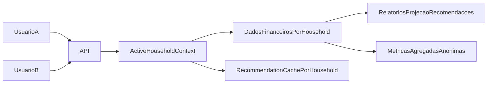

# Documentacao futura: Conta Compartilhada (Espaco Familiar)

## Objetivo
Implementar um modelo de espaco familiar compartilhado onde dois ou mais usuarios operam sobre o mesmo conjunto de dados financeiros, mantendo isolamento entre espacos e habilitando metricas de marketing somente agregadas e anonimas.

## Escopo funcional
- Convidar membro por e-mail para o espaco familiar.
- Aceitar convite e entrar no mesmo espaco de dados.
- Permissao inicial: todos os membros com perfil editor completo.
- Todo dado financeiro passa a ser escopado por `household_id`.
- Recomendacao/projecao/relatorios respeitam o escopo do espaco.
- Marketing com metricas agregadas e sem PII.

## Estado atual (ponto de partida)
- Grande parte das consultas e validacoes usa `user_id` como escopo.
- Rotas autenticadas: `routes/api.php`.
- Autenticacao: `app/Http/Controllers/Api/V1/AuthController.php`.
- Store de autenticacao frontend: `resources/js/stores/auth.js`.

## Arquitetura proposta

## Modelo de dados proposto
- Tabela `households`
  - `id`, `name`, `owner_user_id`, timestamps
- Tabela `household_members`
  - `id`, `household_id`, `user_id`, `role`, `status`, `invited_by_user_id`, `accepted_at`, timestamps
- Tabela `household_invites`
  - `id`, `household_id`, `email`, `token`, `expires_at`, `invited_by_user_id`, `accepted_at`, timestamps
- Adicao de `household_id` nas entidades:
  - contas, transacoes, recorrencias, dividas, investimentos, metas e historico de planos.

## Endpoints previstos
- `GET /households/current`
- `GET /households/current/members`
- `POST /households/current/invites`
- `POST /household-invites/accept`
- `DELETE /households/current/members/{userId}`

## Regras de seguranca
- Todo endpoint financeiro deve resolver `active_household_id` e filtrar por ele.
- `Rule::exists(...)` deve validar recursos dentro do mesmo `household_id`.
- Usuario fora do espaco nao pode ler/escrever dados daquele espaco.
- `user_id` pode seguir como autoria/auditoria, mas nao como escopo primario.

## Impacto tecnico por camada
- Backend
  - Controllers e services que hoje usam `request->user()->id` no escopo.
  - Cache de recomendacoes precisa usar chave por `household_id`.
- Frontend
  - Exibir contexto do espaco atual.
  - Nova tela de membros/convites.
  - Atualizar store de auth para carregar contexto de household.

## Estrategia de migracao e rollout
- Fase 1: schema e compatibilidade
  - Criar tabelas de household e coluna `household_id` nullable.
  - Criar household padrao por usuario.
- Fase 2: backfill
  - Popular `household_id` em dados existentes.
- Fase 3: troca de escopo
  - Substituir filtros de `user_id` para `household_id` em API/servicos/validacoes.
- Fase 4: hardening
  - Tornar `household_id` obrigatorio e reforcar indices.

## Marketing (agregado e anonimo)
- Permitido
  - Quantidade de households ativos.
  - Media de membros por household.
  - Taxa de convites enviados/aceitos.
  - Adocao de funcionalidades por periodo (sem identificacao individual).
- Nao permitido
  - Exportar eventos com nome, e-mail, ID de usuario ou qualquer dado pessoal.

## Criterios de aceite
- Membros do mesmo household visualizam e editam os mesmos dados.
- Isolamento estrito entre households.
- Recomendacao/projecao/relatorios integro apos migracao.
- Cache e invalidacao funcionando por household.
- Pipeline de marketing apenas com agregados anonimos.

## Riscos e mitigacao
- Risco: vazamento por query nao migrada.
  - Mitigacao: testes de autorizacao por household em todos os endpoints.
- Risco: regressao de performance.
  - Mitigacao: indices compostos com `household_id` nas tabelas de maior volume.
- Risco: inconsistencias no backfill.
  - Mitigacao: scripts idempotentes e validacoes de contagem antes/depois.

## Checklist de implementacao futura
- Definir migrations e models de household.
- Implementar contexto ativo de household na autenticacao.
- Criar APIs de convite/membros.
- Migrar escopo de todas as entidades financeiras.
- Ajustar cache e invalidacao por household.
- Criar tela frontend de compartilhamento.
- Adicionar suite de testes de isolamento.
- Publicar metricas agregadas/anonimas para marketing.
